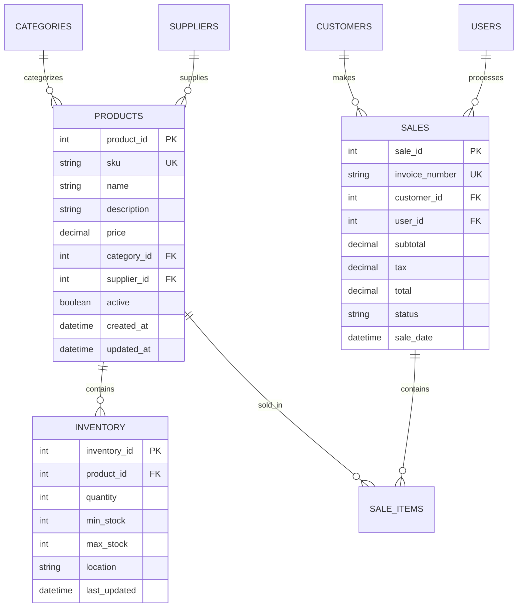

# Documentación Final
## Sistema Integral para el Control y Venta de Autopartes, Lubricantes y Suministros Vehiculares


## CONTROL DE DOCUMENTO

| Campo | Información |
|-------|-------------|
| **Título del Proyecto** | Sistema Integral para el Control y Venta de Autopartes |
| **Versión del Documento** | [1.5] |
| **Fecha de Creación** | [30/08/2025] |
| **Última Actualización** | [26/09/2025] |
| **Autor(es)** | [Angel Ambrocio,Wilson Coc, Josue Car, X] |
| **Estado** | [Proceso de completación] |

### Historial de Versiones

| Versión | Fecha | Autor | Descripción de Cambios |
|---------|-------|-------|------------------------|
| 1.0 | [DD/MM/AAAA] | [Nombre] | Versión inicial |
| 1.1 | [DD/MM/AAAA] | [Nombre] | Actualización de APIs |
| | | | |

---

## 📑 ÍNDICE

1. [Resumen Ejecutivo](#resumen-ejecutivo)
2. [Arquitectura General](#arquitectura-general)
3. [Documentación de Base de Datos](#documentación-de-base-de-datos)
4. [Documentación de Backend](#documentación-de-backend)
5. [Documentación de Frontend](#documentación-de-frontend)
6. [Documentación de Integración](#documentación-de-integración)
7. [Documentación de Despliegue](#documentación-de-despliegue)
8. [Documentación de Testing](#documentación-de-testing)
9. [Documentación de Mantenimiento](#documentación-de-mantenimiento)
10. [Anexos](#anexos)

---

## 1. RESUMEN EJECUTIVO

### 1.1 Propósito del Sistema
[Descripción breve del sistema de autopartes y sus objetivos principales]

### 1.2 Alcance del Proyecto
- **Módulos Implementados:**
  - Gestión de Inventario de Autopartes
  - Sistema de Ventas y Facturación
  - Control de Proveedores y Compras
  - Gestión de Clientes
  - Reportes y Analytics
  - [Otros módulos]

### 1.3 Tecnologías Utilizadas
- **Frontend:** [React/Vue/Angular + versión]
- **Backend:** [Node.js/Python/Java + framework]
- **Base de Datos:** [PostgreSQL/MySQL/MongoDB + versión]
- **Infraestructura:** [AWS/Azure/GCP]

### 1.4 Equipo de Desarrollo
| Rol | Nombre | Responsabilidades |
|-----|--------|-------------------|
| **Team Lead** | [Nombre] | Coordinación general |
| **Backend Lead** | [Nombre] | Arquitectura de servicios |
| **Frontend Lead** | [Nombre] | Interfaz de usuario |
| **DB Architect** | [Nombre] | Diseño de base de datos |
| **DevOps** | [Nombre] | Despliegue e infraestructura |

---

## 2. ARQUITECTURA GENERAL

### 2.1 Arquitectura del Sistema

```mermaid
graph TB
    subgraph "Frontend Layer"
        UI[Web Application]
        Mobile[Mobile App]
    end
    
    subgraph "API Gateway"
        Gateway[API Gateway/Load Balancer]
    end
    
    subgraph "Backend Services"
        Auth[Authentication Service]
        Inventory[Inventory Service]
        Sales[Sales Service]
        Reports[Reports Service]
    end
    
    subgraph "Data Layer"
        DB[(PostgreSQL)]
        Cache[(Redis)]
        Files[File Storage]
    end
    
    UI --> Gateway
    Mobile --> Gateway
    Gateway --> Auth
    Gateway --> Inventory
    Gateway --> Sales
    Gateway --> Reports
    Auth --> DB
    Inventory --> DB
    Sales --> DB
    Reports --> DB
    Backend Services --> Cache
```

### 2.2 Patrones de Diseño Implementados
- **Arquitectura:** Microservicios/Monolito Modular
- **Patrones Backend:** Repository, Service Layer, Factory
- **Patrones Frontend:** Component-based, State Management
- **Patrones de Datos:** Active Record/Data Mapper

### 2.3 Principios de Arquitectura
- Separación de responsabilidades
- Escalabilidad horizontal
- Tolerancia a fallos
- Seguridad por capas

---

## 3. DOCUMENTACIÓN DE BASE DE DATOS

### 3.1 Modelo Entidad-Relación



### 3.2 Diccionario de Datos

#### Tabla: PRODUCTS
| Campo | Tipo | Longitud | Nulo | Clave | Descripción |
|-------|------|----------|------|-------|-------------|
| product_id | INT | - | NO | PK | Identificador único del producto |
| sku | VARCHAR | 50 | NO | UK | Código SKU del producto |
| name | VARCHAR | 200 | NO | - | Nombre del producto |
| description | TEXT | - | SÍ | - | Descripción detallada |
| price | DECIMAL | 10,2 | NO | - | Precio unitario |
| category_id | INT | - | NO | FK | Referencia a categoría |
| supplier_id | INT | - | NO | FK | Referencia a proveedor |
| active | BOOLEAN | - | NO | - | Estado activo/inactivo |
| created_at | TIMESTAMP | - | NO | - | Fecha de creación |
| updated_at | TIMESTAMP | - | NO | - | Fecha de actualización |

### 3.3 Índices y Optimización
```sql
-- Índices principales
CREATE INDEX idx_products_sku ON products(sku);
CREATE INDEX idx_products_category ON products(category_id);
CREATE INDEX idx_inventory_product ON inventory(product_id);
CREATE INDEX idx_sales_date ON sales(sale_date);
CREATE INDEX idx_sales_customer ON sales(customer_id);
```

### 3.4 Procedimientos Almacenados
```sql
-- Ejemplo: Actualizar inventario después de venta
DELIMITER //
CREATE PROCEDURE UpdateInventoryAfterSale(
    IN p_product_id INT,
    IN p_quantity INT
)
BEGIN
    UPDATE inventory 
    SET quantity = quantity - p_quantity,
        last_updated = NOW()
    WHERE product_id = p_product_id;
END //
DELIMITER ;
```

### 3.5 Estrategia de Backup
- **Backup Completo:** Diario a las 2:00 AM
- **Backup Incremental:** Cada 6 horas
- **Retención:** 30 días para backups diarios, 12 meses para backups semanales
- **Ubicación:** [Especificar ubicación de backups]

---

## 4. DOCUMENTACIÓN DE BACKEND

### 4.1 Arquitectura de Servicios

#### 4.1.1 Estructura de Directorios
```
backend/
├── src/
│   ├── controllers/     # Controladores de API
│   ├── services/        # Lógica de negocio
│   ├── models/          # Modelos de datos
│   ├── repositories/    # Acceso a datos
│   ├── middleware/      # Middleware personalizado
│   ├── utils/           # Utilidades
│   └── config/          # Configuraciones
├── tests/               # Pruebas unitarias
├── docs/                # Documentación API
└── scripts/             # Scripts de utilidad
```

### 4.2 APIs Principales

#### 4.2.1 API de Productos
```javascript
// GET /api/products
// Obtener lista de productos con paginación
app.get('/api/products', async (req, res) => {
    // Implementación
});

// POST /api/products
// Crear nuevo producto
app.post('/api/products', async (req, res) => {
    // Validación y creación
});

// PUT /api/products/:id
// Actualizar producto existente
app.put('/api/products/:id', async (req, res) => {
    // Actualización
});
```

#### 4.2.2 Documentación Swagger
```yaml
/api/products:
  get:
    summary: Obtener productos
    parameters:
      - name: page
        in: query
        type: integer
        default: 1
      - name: limit
        in: query
        type: integer
        default: 10
      - name: category
        in: query
        type: string
    responses:
      200:
        description: Lista de productos
        schema:
          type: object
          properties:
            data:
              type: array
              items:
                $ref: '#/definitions/Product'
            pagination:
              $ref: '#/definitions/Pagination'
```

### 4.3 Modelos de Datos
```javascript
// models/Product.js
class Product {
    constructor(data) {
        this.id = data.id;
        this.sku = data.sku;
        this.name = data.name;
        this.description = data.description;
        this.price = data.price;
        this.categoryId = data.category_id;
        this.supplierId = data.supplier_id;
        this.active = data.active;
        this.createdAt = data.created_at;
        this.updatedAt = data.updated_at;
    }

    validate() {
        // Validaciones de negocio
    }

    static async findById(id) {
        // Implementación
    }
}
```

### 4.4 Servicios de Negocio
```javascript
// services/InventoryService.js
class InventoryService {
    async updateStock(productId, quantity, operation) {
        // Lógica para actualizar stock
        // Validaciones de negocio
        // Notificaciones de stock bajo
    }

    async checkLowStock() {
        // Verificar productos con stock bajo
    }

    async generateStockReport() {
        // Generar reporte de inventario
    }
}
```

### 4.5 Seguridad
- **Autenticación:** JWT con refresh tokens
- **Autorización:** RBAC (Role-Based Access Control)
- **Validación:** Joi/Yup para validación de entrada
- **Rate Limiting:** Express-rate-limit
- **CORS:** Configuración restrictiva
- **Helmet:** Headers de seguridad

### 4.6 Variables de Entorno
```bash
# .env.example
NODE_ENV=development
PORT=3000
DB_HOST=localhost
DB_PORT=5432
DB_NAME=autopartes_db
DB_USER=username
DB_PASS=password
JWT_SECRET=your-secret-key
REDIS_URL=redis://localhost:6379
```

---

## 5. DOCUMENTACIÓN DE FRONTEND

### 5.1 Arquitectura de UI

#### 5.1.1 Estructura de Componentes
```
ASII_project-master
├── .github
├── .husky
├── .next
├── .vscode
├── node_modules
├── public
└── src
    ├── app
    ├── componests
    ├── contexts
    ├── hooks
    ├── them
    └── utils


```

### 5.2 Componentes Principales

#### 5.2.1 Pruebas de interfaz (UI)
```jsx
//

Comprobé la alineación, tamaños, colores, fuentes y estilos de los elementos en pantalla, validando que se ajustaran al diseño esperado.

Revisé la responsividad de la aplicación, verificando cómo se adapta en diferentes resoluciones: desktop, tablet y móvil.

Validé la accesibilidad básica, asegurándome de que hubiera buen contraste de colores, etiquetas visibles en los inputs y que los textos fueran legibles.


```

#### 5.2.2 Productos cerca de ti
```jsx
//

El mapa de ubicación no funciona correctamente.

Al intentar mostrar la posición actual del usuario, no se carga la ubicación ni se marca en el mapa.

Esto impide que la funcionalidad de geolocalización cumpla su propósito en la aplicación.


```

### 5.3 Validación de creación de cuentas:
```javascript
Probé la funcionalidad de crear nuevas cuentas y funciona correctamente.

Los datos se aceptan según los campos requeridos, las validaciones de inputs se muestran correctamente y el usuario puede completar el registro sin errores.

```

### 5.4 Botón de búsqueda:
```javascript
Detecté un bug en el botón de búsqueda: al presionarlo, el resultado esperado no se muestra correctamente y el botón parece quedarse en la misma posición sin realizar la acción.

Esto afecta la experiencia del usuario, ya que no se puede buscar correctamente.


```

### 5.5 Guía de Estilos UI/UX

#### 5.5.1 Paleta de Colores
```css
:root {
    --primary-color: #2563eb;      /* Azul principal */
    --secondary-color: #64748b;    /* Gris secundario */
    --success-color: #059669;      /* Verde éxito */
    --warning-color: #d97706;      /* Naranja advertencia */
    --error-color: #dc2626;        /* Rojo error */
    --background-color: #f8fafc;   /* Fondo principal */
    --text-primary: #1e293b;       /* Texto principal */
    --text-secondary: #64748b;     /* Texto secundario */
}
```

#### 5.5.2 Componentes de Diseño
```css
/* Botones */
.btn-primary {
    background-color: var(--primary-color);
    color: white;
    padding: 0.5rem 1rem;
    border-radius: 0.375rem;
    border: none;
    cursor: pointer;
    transition: all 0.2s;
}

.btn-primary:hover {
    background-color: #1d4ed8;
    transform: translateY(-1px);
}

/* Cards */
.card {
    background: white;
    border-radius: 0.5rem;
    box-shadow: 0 1px 3px rgba(0, 0, 0, 0.1);
    padding: 1.5rem;
    margin-bottom: 1rem;
}
```

### 5.6 Responsive Design
```css
/* Mobile First Approach */
.product-grid {
    display: grid;
    grid-template-columns: 1fr;
    gap: 1rem;
}

@media (min-width: 768px) {
    .product-grid {
        grid-template-columns: repeat(2, 1fr);
    }
}

@media (min-width: 1024px) {
    .product-grid {
        grid-template-columns: repeat(3, 1fr);
    }
}

@media (min-width: 1280px) {
    .product-grid {
        grid-template-columns: repeat(4, 1fr);
    }
}
```

### 5.7 Flujos de Usuario Principales

#### 5.7.1 Flujo de Venta
1. **Selección de Cliente:** Buscar o crear cliente
2. **Agregar Productos:** Buscar y agregar productos al carrito
3. **Calcular Total:** Aplicar descuentos e impuestos
4. **Procesar Pago:** Seleccionar método de pago
5. **Generar Factura:** Crear documento fiscal
6. **Actualizar Inventario:** Reducir stock automáticamente

#### 5.7.2 Flujo de Gestión de Inventario
1. **Ver Inventario Actual:** Lista con filtros y búsqueda
2. **Agregar Producto:** Formulario con validaciones
3. **Actualizar Stock:** Entrada/salida de mercancía
4. **Alertas de Stock Bajo:** Notificaciones automáticas
5. **Reportes:** Generación de reportes de inventario

---

## 6. DOCUMENTACIÓN DE INTEGRACIÓN

### 6.1 Comunicación Frontend-Backend

#### 6.1.1 Interceptores HTTP
```javascript
// utils/httpClient.js
import axios from 'axios';

const httpClient = axios.create({
    baseURL: process.env.REACT_APP_API_URL,
    timeout: 10000
});

// Request interceptor
httpClient.interceptors.request.use(
    (config) => {
        const token = localStorage.getItem('token');
        if (token) {
            config.headers.Authorization = `Bearer ${token}`;
        }
        return config;
    },
    (error) => Promise.reject(error)
);

// Response interceptor
httpClient.interceptors.response.use(
    (response) => response,
    (error) => {
        if (error.response?.status === 401) {
            // Redirect to login
            window.location.href = '/login';
        }
        return Promise.reject(error);
    }
);
```

### 6.2 APIs Externas

#### 6.2.1 Integración con SUNAT (Perú)
```javascript
// services/sunatService.js
class SunatService {
    async validateRUC(ruc) {
        try {
            const response = await fetch(`https://api.sunat.gob.pe/v1/ruc/${ruc}`);
            return response.json();
        } catch (error) {
            throw new Error('Error validating RUC');
        }
    }

    async sendInvoice(invoiceData) {
        // Envío de factura electrónica a SUNAT
        const xmlData = this.generateXML(invoiceData);
        // Implementar envío
    }
}
```

#### 6.2.2 Integración con Proveedores
```javascript
// services/supplierIntegration.js
class SupplierIntegration {
    async syncCatalog(supplierId) {
        // Sincronizar catálogo de productos del proveedor
        const catalog = await this.fetchSupplierCatalog(supplierId);
        await this.updateLocalCatalog(catalog);
    }

    async checkPriceUpdates() {
        // Verificar actualizaciones de precios
    }
}
```

### 6.3 WebSockets para Tiempo Real
```javascript
// services/websocketService.js
class WebSocketService {
    constructor() {
        this.socket = null;
    }

    connect() {
        this.socket = new WebSocket(process.env.REACT_APP_WS_URL);
        
        this.socket.onmessage = (event) => {
            const data = JSON.parse(event.data);
            this.handleMessage(data);
        };
    }

    handleMessage(data) {
        switch (data.type) {
            case 'STOCK_UPDATE':
                // Actualizar stock en tiempo real
                break;
            case 'NEW_SALE':
                // Notificar nueva venta
                break;
        }
    }
}
```

---

## 7. DOCUMENTACIÓN DE DESPLIEGUE

### 7.1 Ambientes

#### 7.1.1 Desarrollo (Development)
- **URL:** http://dev.autopartes.local
- **Base de Datos:** PostgreSQL local
- **Propósito:** Desarrollo y pruebas iniciales

#### 7.1.2 Pruebas (Staging)
- **URL:** https://staging.autopartes.com
- **Base de Datos:** PostgreSQL en AWS RDS
- **Propósito:** Testing de integración y UAT

#### 7.1.3 Producción (Production)
- **URL:** https://autopartes.com
- **Base de Datos:** PostgreSQL en AWS RDS (Multi-AZ)
- **Propósito:** Sistema en vivo

### 7.2 Configuración de Infraestructura

#### 7.2.1 Docker Configuration
```dockerfile
# Dockerfile para Backend
FROM node:18-alpine

WORKDIR /app

COPY package*.json ./
RUN npm ci --only=production

COPY . .

EXPOSE 3000

CMD ["npm", "start"]
```

```dockerfile
# Dockerfile para Frontend
FROM node:18-alpine as builder

WORKDIR /app
COPY package*.json ./
RUN npm ci

COPY . .
RUN npm run build

FROM nginx:alpine
COPY --from=builder /app/build /usr/share/nginx/html
COPY nginx.conf /etc/nginx/nginx.conf

EXPOSE 80
CMD ["nginx", "-g", "daemon off;"]
```

#### 7.2.2 Docker Compose
```yaml
# docker-compose.yml
version: '3.8'

services:
  backend:
    build: ./backend
    ports:
      - "3000:3000"
    environment:
      - NODE_ENV=production
      - DB_HOST=db
    depends_on:
      - db
      - redis

  frontend:
    build: ./frontend
    ports:
      - "80:80"
    depends_on:
      - backend

  db:
    image: postgres:15
    environment:
      POSTGRES_DB: autopartes
      POSTGRES_USER: admin
      POSTGRES_PASSWORD: ${DB_PASSWORD}
    volumes:
      - postgres_data:/var/lib/postgresql/data

  redis:
    image: redis:7-alpine
    ports:
      - "6379:6379"

volumes:
  postgres_data:
```

### 7.3 Pipeline CI/CD

#### 7.3.1 GitHub Actions
```yaml
# .github/workflows/deploy.yml
name: Deploy to Production

on:
  push:
    branches: [main]

jobs:
  test:
    runs-on: ubuntu-latest
    steps:
      - uses: actions/checkout@v3
      - uses: actions/setup-node@v3
        with:
          node-version: '18'
      - run: npm ci
      - run: npm test

  deploy:
    needs: test
    runs-on: ubuntu-latest
    steps:
      - uses: actions/checkout@v3
      - name: Deploy to AWS
        run: |
          # Scripts de despliegue
```

### 7.4 Monitoreo y Logging

#### 7.4.1 Configuración de Logs
```javascript
// utils/logger.js
const winston = require('winston');

const logger = winston.createLogger({
    level: 'info',
    format: winston.format.combine(
        winston.format.timestamp(),
        winston.format.errors({ stack: true }),
        winston.format.json()
    ),
    transports: [
        new winston.transports.File({ filename: 'error.log', level: 'error' }),
        new winston.transports.File({ filename: 'combined.log' })
    ]
});

if (process.env.NODE_ENV !== 'production') {
    logger.add(new winston.transports.Console({
        format: winston.format.simple()
    }));
}
```

#### 7.4.2 Health Checks
```javascript
// routes/health.js
app.get('/health', async (req, res) => {
    const health = {
        status: 'OK',
        timestamp: new Date().toISOString(),
        services: {
            database: await checkDatabase(),
            redis: await checkRedis(),
            external_apis: await checkExternalAPIs()
        }
    };
    
    res.json(health);
});
```

---

## 8. DOCUMENTACIÓN DE TESTING

### 8.1 Estrategia de Testing por Capas

#### 8.1.1 Testing de Base de Datos
```sql
-- tests/database/test_products.sql
-- Test: Verificar integridad referencial
INSERT INTO categories (name) VALUES ('Test Category');
SET @category_id = LAST_INSERT_ID();

INSERT INTO products (sku, name, price, category_id) 
VALUES ('TEST-001', 'Test Product', 99.99, @category_id);

-- Verificar que el producto se creó correctamente
SELECT COUNT(*) as count FROM products WHERE sku = 'TEST-001';
-- Esperado: 1

-- Cleanup
DELETE FROM products WHERE sku = 'TEST-001';
DELETE FROM categories WHERE id = @category_id;
```

#### 8.1.2 Testing de Backend
```javascript
// tests/unit/services/productService.test.js
describe('ProductService', () => {
    let productService;
    
    beforeEach(() => {
        productService = new ProductService();
    });

    describe('createProduct', () => {
        it('should create a product with valid data', async () => {
            const productData = {
                sku: 'TEST-001',
                name: 'Test Product',
                price: 99.99,
                categoryId: 1
            };

            const result = await productService.createProduct(productData);
            
            expect(result.id).toBeDefined();
            expect(result.sku).toBe('TEST-001');
        });

        it('should throw error with duplicate SKU', async () => {
            const productData = {
                sku: 'EXISTING-SKU',
                name: 'Test Product',
                price: 99.99,
                categoryId: 1
            };

            await expect(productService.createProduct(productData))
                .rejects.toThrow('SKU already exists');
        });
    });
});
```

#### 8.1.3 Testing de APIs
```javascript
// tests/integration/api/products.test.js
describe('Products API', () => {
    let server;
    let authToken;

    beforeAll(async () => {
        server = await createTestServer();
        authToken = await getTestAuthToken();
    });

    afterAll(async () => {
        await server.close();
    });

    describe('GET /api/products', () => {
        it('should return products list', async () => {
            const response = await request(server)
                .get('/api/products')
                .set('Authorization', `Bearer ${authToken}`)
                .expect(200);

            expect(response.body.data).toBeInstanceOf(Array);
            expect(response.body.pagination).toBeDefined();
        });

        it('should filter by category', async () => {
            const response = await request(server)
                .get('/api/products?category=1')
                .set('Authorization', `Bearer ${authToken}`)
                .expect(200);

            response.body.data.forEach(product => {
                expect(product.categoryId).toBe(1);
            });
        });
    });
});
```

#### 8.1.4 Testing de Frontend
```jsx
// tests/components/ProductList.test.jsx
import { render, screen, waitFor } from '@testing-library/react';
import { ProductList } from '../components/ProductList';
import * as productService from '../services/productService';

jest.mock('../services/productService');

describe('ProductList Component', () => {
    beforeEach(() => {
        jest.clearAllMocks();
    });

    it('should display products when loaded', async () => {
        const mockProducts = [
            { id: 1, name: 'Product 1', price: 99.99 },
            { id: 2, name: 'Product 2', price: 149.99 }
        ];

        productService.getProducts.mockResolvedValue({
            data: mockProducts,
            pagination: { total: 2 }
        });

        render(<ProductList />);

        await waitFor(() => {
            expect(screen.getByText('Product 1')).toBeInTheDocument();
            expect(screen.getByText('Product 2')).toBeInTheDocument();
        });
    });

    it('should display error message on API failure', async () => {
        productService.getProducts.mockRejectedValue(
            new Error('API Error')
        );

        render(<ProductList />);

        await waitFor(() => {
            expect(screen.getByText(/error/i)).toBeInTheDocument();
        });
    });
});
```

### 8.2 Testing End-to-End
```javascript
// tests/e2e/sales-flow.spec.js
describe('Sales Flow', () => {
    it('should complete a sale from start to finish', async () => {
        // 1. Login
        await page.goto('/login');
        await page.fill('[data-testid="username"]', 'testuser');
        await page.fill('[data-testid="password"]', 'password');
        await page.click('[data-testid="login-button"]');

        // 2. Navigate to sales
        await page.click('[data-testid="sales-menu"]');
        await page.click('[data-testid="new-sale"]');

        // 3. Select customer
        await page.click('[data-testid="customer-select"]');
        await page.click('[data-testid="customer-option-1"]');

        // 4. Add products
        await page.click('[data-testid="add-product"]');
        await page.fill('[data-testid="product-search"]', 'brake pad');
        await page.click('[data-testid="product-result-1"]');
        await page.fill('[data-testid="quantity"]', '2');
        await page.click('[data-testid="add-to-cart"]');

        // 5. Process payment
        await page.click('[data-testid="process-payment"]');
        await page.click('[data-testid="payment-cash"]');
        await page.click('[data-testid="complete-sale"]');

        // 6. Verify success
        await expect(page.locator('[data-testid="success-message"]'))
            .toBeVisible();
    });
});
```

### 8.3 Automatización de Testing
```yaml
# .github/workflows/test.yml
name: Test Suite

on: [push, pull_request]

jobs:
  unit-tests:
    runs-on: ubuntu-latest
    steps:
      - uses: actions/checkout@v3
      - uses: actions/setup-node@v3
      - run: npm ci
      - run: npm run test:unit
      - run: npm run test:coverage

  integration-tests:
    runs-on: ubuntu-latest
    services:
      postgres:
        image: postgres:15
        env:
          POSTGRES_PASSWORD: postgres
        options: >-
          --health-cmd pg_isready
          --health-interval 10s
          --health-timeout 5s
          --health-retries 5
    steps:
      - uses: actions/checkout@v3
      - run: npm run test:integration

  e2e-tests:
    runs-on: ubuntu-latest
    steps:
      - uses: actions/checkout@v3
      - uses: actions/setup-node@v3
      - run: npm ci
      - run: npx playwright install
      - run: npm run test:e2e
```

---

## 9. DOCUMENTACIÓN DE MANTENIMIENTO

### 9.1 Troubleshooting Guide

#### 9.1.1 Problemas Comunes de Base de Datos
| Problema | Síntomas | Solución |
|----------|----------|----------|
| **Conexión lenta** | Consultas tardan >5s | Revisar índices, optimizar queries |
| **Deadlocks** | Errores de transacción | Revisar orden de locks, reducir tiempo de transacción |
| **Espacio en disco** | Error "disk full" | Limpiar logs, archivar datos antiguos |
| **Backup fallido** | Logs de error en backup | Verificar permisos, espacio disponible |

#### 9.1.2 Problemas de Backend
| Problema | Síntomas | Solución |
|----------|----------|----------|
| **Memory leak** | Uso de RAM creciente | Revisar event listeners, cerrar conexiones |
| **API timeout** | Respuestas lentas | Optimizar queries, implementar cache |
| **401 Unauthorized** | Errores de autenticación | Verificar JWT secret, renovar tokens |
| **500 Internal Error** | Errores del servidor | Revisar logs, validar datos de entrada |

#### 9.1.3 Problemas de Frontend
| Problema | Síntomas | Solución |
|----------|----------|----------|
| **Página en blanco** | White screen of death | Revisar console errors, bundle size |
| **Carga lenta** | Performance issues | Optimizar imágenes, code splitting |
| **Formularios no envían** | Submit no funciona | Validar network requests, CORS |
| **Datos desactualizados** | Cache stale | Implementar invalidación de cache |

### 9.2 Procedimientos de Actualización

#### 9.2.1 Actualización de Base de Datos
```sql
-- migrations/001_add_product_variants.sql
-- Migración: Agregar tabla de variantes de productos
CREATE TABLE product_variants (
    id SERIAL PRIMARY KEY,
    product_id INTEGER REFERENCES products(id),
    variant_name VARCHAR(100) NOT NULL,
    sku VARCHAR(50) UNIQUE NOT NULL,
    price DECIMAL(10,2) NOT NULL,
    created_at TIMESTAMP DEFAULT CURRENT_TIMESTAMP
);

-- Rollback script
-- DROP TABLE product_variants;
```

#### 9.2.2 Actualización de Backend
```bash
#!/bin/bash
# scripts/deploy-backend.sh

echo "Starting backend deployment..."

# 1. Backup current version
cp -r /app/current /app/backup-$(date +%Y%m%d-%H%M%S)

# 2. Stop application
pm2 stop autopartes-api

# 3. Update code
git pull origin main
npm ci --production

# 4. Run migrations
npm run migrate

# 5. Start application
pm2 start autopartes-api

# 6. Health check
sleep 10
curl -f http://localhost:3000/health || {
    echo "Health check failed, rolling back..."
    pm2 stop autopartes-api
    cp -r /app/backup-* /app/current
    pm2 start autopartes-api
    exit 1
}

echo "Deployment completed successfully"
```

#### 9.2.3 Actualización de Frontend
```bash
#!/bin/bash
# scripts/deploy-frontend.sh

echo "Starting frontend deployment..."

# 1. Build new version
npm run build

# 2. Backup current version
cp -r /var/www/html /var/www/backup-$(date +%Y%m%d-%H%M%S)

# 3. Deploy new version
cp -r build/* /var/www/html/

# 4. Clear CDN cache (if applicable)
aws cloudfront create-invalidation --distribution-id $CDN_ID --paths "/*"

echo "Frontend deployment completed"
```

### 9.3 Monitoreo y Alertas

#### 9.3.1 Métricas Clave
```javascript
// monitoring/metrics.js
const metrics = {
    // Performance metrics
    responseTime: 'avg_response_time_ms',
    throughput: 'requests_per_second',
    errorRate: 'error_rate_percentage',
    
    // Business metrics
    dailySales: 'daily_sales_count',
    inventoryTurnover: 'inventory_turnover_rate',
    customerSatisfaction: 'customer_satisfaction_score',
    
    // System metrics
    cpuUsage: 'cpu_usage_percentage',
    memoryUsage: 'memory_usage_percentage',
    diskSpace: 'disk_usage_percentage',
    databaseConnections: 'active_db_connections'
};
```

#### 9.3.2 Configuración de Alertas
```yaml
# alerting/rules.yml
groups:
  - name: autopartes-alerts
    rules:
      - alert: HighErrorRate
        expr: error_rate > 0.05
        for: 5m
        annotations:
          summary: "High error rate detected"
          description: "Error rate is {{ $value }}%"

      - alert: DatabaseDown
        expr: up{job="postgres"} == 0
        for: 1m
        annotations:
          summary: "Database is down"

      - alert: LowStock
        expr: products_low_stock > 10
        for: 15m
        annotations:
          summary: "Multiple products with low stock"
```

### 9.4 Responsables y Contactos

#### 9.4.1 Equipo de Soporte
| Rol | Nombre | Email | Teléfono | Responsabilidades |
|-----|--------|-------|----------|-------------------|
| **Tech Lead** | [Nombre] | tech.lead@company.com | +51-xxx-xxxx | Arquitectura, decisiones técnicas |
| **DevOps** | [Nombre] | devops@company.com | +51-xxx-xxxx | Infraestructura, despliegues |
| **DBA** | [Nombre] | dba@company.com | +51-xxx-xxxx | Base de datos, backups |
| **Frontend Lead** | [Nombre] | frontend@company.com | +51-xxx-xxxx | UI/UX, componentes |
| **Backend Lead** | [Nombre] | backend@company.com | +51-xxx-xxxx | APIs, lógica de negocio |

#### 9.4.2 Escalamiento de Incidentes
1. **Nivel 1 (Desarrollador):** Problemas menores, bugs conocidos
2. **Nivel 2 (Team Lead):** Problemas de integración, performance
3. **Nivel 3 (Arquitecto):** Problemas de arquitectura, decisiones críticas
4. **Nivel 4 (Management):** Problemas que afectan el negocio

### 9.5 Backup y Recuperación

#### 9.5.1 Procedimiento de Backup
```bash
#!/bin/bash
# scripts/backup.sh

DATE=$(date +%Y%m%d_%H%M%S)
BACKUP_DIR="/backups/$DATE"

# Create backup directory
mkdir -p $BACKUP_DIR

# Database backup
pg_dump -h $DB_HOST -U $DB_USER $DB_NAME > $BACKUP_DIR/database.sql

# Files backup
tar -czf $BACKUP_DIR/files.tar.gz /app/uploads

# Configuration backup
cp -r /app/config $BACKUP_DIR/

# Upload to S3
aws s3 sync $BACKUP_DIR s3://autopartes-backups/$DATE/

echo "Backup completed: $BACKUP_DIR"
```

#### 9.5.2 Procedimiento de Recuperación
```bash
#!/bin/bash
# scripts/restore.sh

BACKUP_DATE=$1

if [ -z "$BACKUP_DATE" ]; then
    echo "Usage: $0 <backup_date>"
    exit 1
fi

# Download from S3
aws s3 sync s3://autopartes-backups/$BACKUP_DATE/ /tmp/restore/

# Stop services
pm2 stop all

# Restore database
psql -h $DB_HOST -U $DB_USER -d $DB_NAME < /tmp/restore/database.sql

# Restore files
tar -xzf /tmp/restore/files.tar.gz -C /

# Restore configuration
cp -r /tmp/restore/config/* /app/config/

# Start services
pm2 start all

echo "Restore completed from backup: $BACKUP_DATE"
```

---

## 10. ANEXOS

### 10.1 Glosario de Términos
- **SKU:** Stock Keeping Unit - Código único de producto
- **API:** Application Programming Interface
- **CRUD:** Create, Read, Update, Delete
- **JWT:** JSON Web Token
- **RBAC:** Role-Based Access Control
- **CI/CD:** Continuous Integration/Continuous Deployment
- **ORM:** Object-Relational Mapping
- **SPA:** Single Page Application
- **REST:** Representational State Transfer
- **CORS:** Cross-Origin Resource Sharing

### 10.2 Referencias y Enlaces
- [Documentación de React](https://reactjs.org/docs)
- [Node.js Best Practices](https://github.com/goldbergyoni/nodebestpractices)
- [PostgreSQL Documentation](https://www.postgresql.org/docs/)
- [Docker Documentation](https://docs.docker.com/)
- [AWS Documentation](https://docs.aws.amazon.com/)

### 10.3 Configuraciones de Ejemplo

#### 10.3.1 Nginx Configuration
```nginx
# nginx.conf
server {
    listen 80;
    server_name autopartes.com;
    
    # Frontend
    location / {
        root /var/www/html;
        try_files $uri $uri/ /index.html;
    }
    
    # API
    location /api/ {
        proxy_pass http://backend:3000;
        proxy_set_header Host $host;
        proxy_set_header X-Real-IP $remote_addr;
        proxy_set_header X-Forwarded-For $proxy_add_x_forwarded_for;
    }
    
    # Static files
    location /uploads/ {
        root /var/www;
        expires 1y;
        add_header Cache-Control "public, immutable";
    }
}
```

#### 10.3.2 PM2 Configuration
```json
{
  "apps": [{
    "name": "autopartes-api",
    "script": "./src/server.js",
    "instances": "max",
    "exec_mode": "cluster",
    "env": {
      "NODE_ENV": "production",
      "PORT": 3000
    },
    "error_file": "./logs/err.log",
    "out_file": "./logs/out.log",
    "log_file": "./logs/combined.log"
  }]
}
```

### 10.4 Checklist de Deployment
- [ ] Tests unitarios pasando
- [ ] Tests de integración pasando
- [ ] Tests E2E pasando
- [ ] Backup de base de datos realizado
- [ ] Variables de entorno configuradas
- [ ] Certificados SSL válidos
- [ ] Monitoreo configurado
- [ ] Alertas configuradas
- [ ] Documentación actualizada
- [ ] Equipo notificado del deployment

---

## 📞 CONTACTO Y SOPORTE

Para consultas sobre esta documentación o el sistema:

- **Email de Soporte:** soporte@autopartes.com
- **Slack Channel:** #autopartes-dev
- **Repositorio:** https://github.com/company/autopartes-system
- **Wiki:** https://wiki.company.com/autopartes

---

*Documento generado el [FECHA] - Versión [X.X]*
*© 2024 [Nombre de la Empresa] - Todos los derechos reservados*
